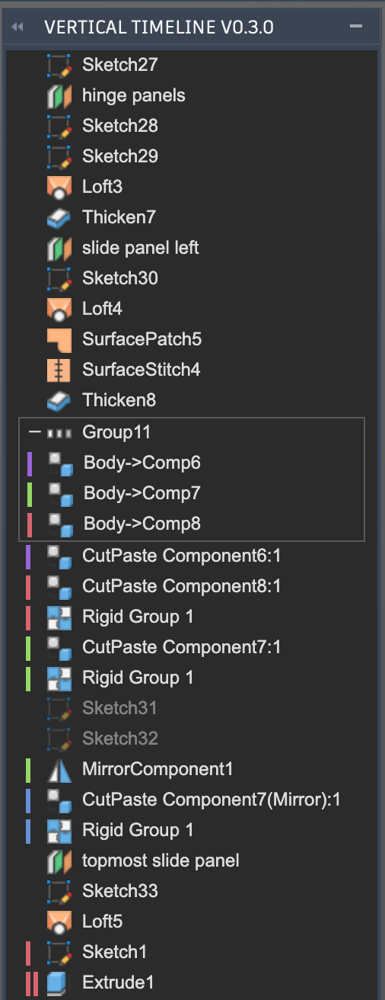

# VerticalTimeline

A Fusion 360 add-in that adds a vertical timeline. Works on Windows and macOS, though development and testing happen primarily on macOS.

The palette adapts to light and dark themes, following your operating system /
Fusion UI color theme.

## Installation

Download the add-in from the [Releases](https://github.com/MatRanc/VerticalTimeline2/releases) page.

Unpack it into `API\AddIns` (see [How to install an add-in or script in Fusion 360](https://knowledge.autodesk.com/support/fusion-360/troubleshooting/caas/sfdcarticles/sfdcarticles/How-to-install-an-ADD-IN-and-Script-in-Fusion-360.html)).

Make sure the directory is named `VerticalTimeline`, with no suffix.

Once installed, the timeline opens automatically whenever a Design is active.

## Usage

The timeline opens by itself. Closing it with its window *X* hides it for the
rest of the session; it comes back on the next Fusion start (or after
reloading the add-in). To turn it off for good, disable the add-in in the
*Scripts and Add-ins* dialog (*Shift+S*).

* Click an item to select it (this also selects it in the Fusion GUI).
* Double-click the name to rename it; double-click anywhere else on the row to
  edit the feature/part.
* Right-click an item for a context menu: *Roll Timeline Marker Here*, *Edit*,
  *Rename*, *Suppress*/*Unsuppress*, and *Delete*. For an item past the history
  marker (rolled back), the menu also offers *Delete all features after History
  Marker*. Right-clicking a sketch adds its native options — *Show/Hide*,
  *Look At*, *Redefine*/*Select Sketch Plane*, *Configure*, and the *Profile* /
  *Dimension* / *Projected* / *Construction* display toggles.
* Drag the history-marker bar (the line between the active and rolled-back
  items) onto a row to roll the marker there, SolidWorks-style.
* *Cmd*/*Ctrl*-click (or *Shift*-click for a range) to select multiple items.
  The selection is pushed to Fusion as a real selection, so you can then run a
  command such as *Mirror* on those features. Right-click to *Create Group* or
  *Suppress*/*Delete* them together.

Selecting a feature in the Fusion GUI (in the native timeline or the browser)
also highlights the matching row in the timeline. Clicking *geometry* in the
viewport does not: Fusion reports the selection as a face/edge, and its API
exposes no way to find the feature that created it (see Known limitations).
Items that Fusion reports as errored or warned are highlighted red or yellow,
with the message shown on hover. A fully constrained sketch shows Fusion's own
lock-badge sketch icon.

The palette shows its own context menu rather than Fusion's native timeline
menu. Some native entries — *Create Selection Set*, *Configure*, *Find in
Browser*, *Find in Window* — have no add-in API to invoke, so they are not
included.

The add-in can be temporarily disabled using the *Scripts and Add-ins* dialog. Press *Shift+S* in Fusion 360™ and go to the *Add-Ins* tab.

## Known limitations

* **Clicking geometry in the viewport does not highlight the creating
  feature's row** ([#14](https://github.com/MatRanc/VerticalTimeline2/issues/14)).
  A viewport click selects a `BRepFace`/`BRepEdge`, and the Fusion API has no
  link from a face back to the feature that created it (`BRepFace` exposes
  geometry, body, edges, tokens — nothing pointing at a feature; re-verified
  against the 2026 API reference). Scanning every feature's face list instead
  would take seconds per click (collection accesses cost ~6 ms each,
  measured), i.e. the issue-#9 freeze again. Selecting the feature itself —
  a native-timeline row, or a sketch/plane/component in the browser — does
  highlight the row.

* **A few feature types show a generic placeholder icon instead of their real
  one** ([#8](https://github.com/MatRanc/VerticalTimeline2/issues/8)). Fusion's
  API hands some features back only as the generic base `Feature` class — with
  no concrete subclass and no other type information — so the add-in cannot tell
  what they are in order to pick an icon. Observed so far: base mesh features,
  some *Scale* features, and *Modify* features. (Note Fusion is inconsistent:
  the *same* feature kind sometimes comes through with its real type, so most
  rows do get the correct icon.) There is no API workaround; the issue is left
  open in case a future Fusion release exposes the type. Any row that falls
  back to the placeholder now logs one line to the *Text Commands* console
  (`no icon resolved for feature type '…'`), which tells apart "Fusion hid the
  type" (`'Feature'`) from "a real type is missing an icon mapping".

* **Some edits on large designs (roughly 1000+ timeline nodes) are still slow**
  ([#10](https://github.com/MatRanc/VerticalTimeline2/issues/10)). Reading the
  timeline out of Fusion costs ~6 ms per item (`Timeline.item(i)` — there is
  no bulk accessor), so a full re-read of a ~1450-feature design takes ~6 s
  with Fusion frozen (API calls run on the main thread). Since v0.7.10 the
  palette reuses the previous refresh's timeline wrappers whenever a cheap
  validation proves the feature set is unchanged (or only grew at the end), so
  the common operations — rolling the marker from either timeline,
  suppress/unsuppress, rename, sketch edits, and adds at the end like extrude —
  refresh in ~0.25 s (measured on a live 1054-slot design). The full ~6 s
  re-read still runs when the structure changed in a way the add-in cannot
  cheaply trust: deletes, inserts in the middle of the history, reorders,
  undo/redo, and the first refresh after switching documents. Fusion's own
  recompute when the marker moves or a feature lands is separate kernel work
  that no add-in can skip. Details and remaining options:
  [PERFORMANCE.md](PERFORMANCE.md).

* **Deleting a group whose contents feed later features fails from the add-in.**
  When a group's features have downstream dependents, Fusion refuses the delete
  through the API: `TimelineGroup.deleteMe(true)` silently does nothing and
  per-feature `deleteMe()` returns `false` — there is no force-delete variant in
  the API (only a plain `deleteMe` and `deleteAllAfterMarker`). The native
  timeline can force it, but only behind a *"permanently delete features — may
  cause downstream issues"* confirmation dialog that the API cannot display. The
  add-in now reports "could not delete (needed by later features)" instead of
  freezing and silently doing nothing; groups **without** downstream dependents
  delete normally. Workaround: delete such a group from Fusion's own timeline.
  Wishlist for Autodesk: a `deleteMe(force)` / dependent-aware delete, or an API
  hook to the native confirmation. (Even when the delete does go through the
  add-in, it is N separate operations, so it takes N undo steps rather than one —
  the scripting API has no way to batch them atomically.)

## Performance and wishlist

Ongoing backlog: [PERFORMANCE.md](PERFORMANCE.md). The big refresh cost above
comes down to one thing — reading the timeline object-by-object. Of the two
ways to attack it, the second is now shipped; the first needs Autodesk:

* **A bulk timeline accessor in the Fusion API (needs Autodesk).** `Timeline`
  exposes only `.count` and `.item(index)`, and each `.item()` call costs
  ~6 ms regardless of index (measured live, 2026-07-15) — ~6 s to read a
  ~1450-object timeline. A single call returning the whole timeline as an
  array — a `Timeline.asArray()` / `allItems`, like many other Fusion
  collections already provide — would turn that into one round-trip and would
  eliminate the remaining full-walk cases below. *If you work on the Fusion
  API team: please add this.* A "timeline changed" event carrying the delta
  would be even better.

* **Incremental refresh (shipped in v0.7.10).** The timeline wrappers held
  from the previous refresh survive Fusion's recompute and act as live views —
  external suppress/roll/rename/health changes read back correctly through
  them, deleted objects flip `isValid`, and property reads on held wrappers
  cost microseconds versus ~6 ms per `Timeline.item(i)` re-materialization
  (all verified against a running Fusion, 2026-07-15). The palette therefore
  reuses the held wrapper list whenever `timeline.count` is unchanged and
  every wrapper is still valid (with order-changing commands — undo/redo/
  reorder — forcing a full re-read by command id), and recognizes the
  marker-at-end append so an extrude materializes only the new object.
  Measured on a live 1054-slot design: 6.36 s → 0.25 s per refresh. The old
  collapsed-group fear turned out to be moot — the reuse path never needs
  `TimelineObject.index` at all. Staleness: the cache holds object
  *references*, not copied values — every refresh re-reads all row state
  through the live wrappers — so rows can never show outdated names,
  suppression, or health; the only theoretical gap is row *order* after an
  order-changing command outside the known undo/redo/reorder id list, which
  self-heals at the next structural change (full analysis: *Can the cache show
  an outdated timeline?* in [PERFORMANCE.md](PERFORMANCE.md)). A bulk accessor
  from Autodesk would still remove the remaining full-walk cases (deletes,
  middle inserts, reorders, cold cache after a document switch).

## Changelog

* v 0.7.10
  * Large-design refreshes are ~25× faster for the common operations. The
    palette now reuses the timeline wrappers from the previous refresh
    whenever a cheap validation shows the feature set is unchanged (or only
    grew at the end), instead of re-reading the whole timeline object by
    object. Rolling the marker (from either timeline), suppress/unsuppress,
    rename, sketch edits, and adds at the end (extrude etc.) refresh in
    ~0.25 s instead of ~6.4 s on a 1054-slot design (measured live). The cache
    holds live object references and all row state is re-read each refresh, so
    reused rows never show outdated data. Deletes, middle-of-history inserts,
    reorders, undo/redo, and document switches still do the full re-read (#10).
  * Rolling the history marker from the palette (right-click → *Roll Timeline
    Marker Here*, or dragging the marker bar) no longer rebuilds the whole
    palette. The rolled-back rows are computed from the cached timeline and
    updated in place, and the `FusionRollCommand` the roll itself fires no
    longer triggers a follow-up full rebuild (rolls made on Fusion's native
    timeline still refresh normally). Any remaining wait on a palette roll is
    Fusion's own recompute of the design (#10).
  * The component parent map behind the colored parent bars is cached across
    refreshes and rebuilt when the timeline count or document changes, instead
    of walking every occurrence on each refresh. Renaming or reparenting a
    component may show stale bars until the next add/delete (#10).
  * Palette row events (click / double-click / context menu) are attached once
    to the timeline container instead of three listeners per row on every
    rebuild (#10).
* v 0.7.9
  * Fixed the stutter when dragging/rotating a jointed component. Each drag
    release fires `FusionDragComponentsCommand`, which is kinematic and never
    changes the timeline, but it was triggering a full palette rebuild anyway;
    it's now skipped like the other selection/commit chatter.
* v 0.7.8
  * The palette is now shown by default. Fresh installs auto-show the timeline;
    existing users keep whatever they last chose. Closing it with the window X
    hides it for the session only - it returns on the next Fusion start or
    add-in reload. To turn the add-in off for good, use Fusion's
    Scripts and Add-Ins dialog (Shift+S) (#11).
  * Removed the redundant Toggle menu item - the palette's own show/hide now
    covers it (#11).
  * Selection highlighting is now driven by the feature's timeline position
    instead of a per-feature entity scan, so highlighting a selected row is
    faster and more reliable on large designs (#14).
  * Mesh-editing features (from the ParaMesh tree) now show their real icons
    instead of the generic placeholder.
* v 0.7.7
  * Deleting a broken/yellow *Create Components from Bodies* row now removes it
    instead of failing (it previously tried to remove the component). The
    delete-recovery that already handled *suppressed* such rows now also covers
    rows in an error/warning state.
  * *Delete group and its contents* no longer silently does nothing. It now
    removes each contained feature individually and, when Fusion refuses to
    delete one because it has downstream dependents, reports that instead of
    freezing and quietly leaving the group in place. Deleting a group whose
    contents feed later features is still a Fusion API limitation (the scripting
    API can't show the "may cause downstream issues" confirmation that the native
    timeline uses to force such deletes) - use the native timeline delete for
    those. Individual deletes are also slower on large groups and take multiple
    undo steps, since the API can't batch them atomically.
* v 0.7.6
  * Emboss, Derive, Rule Fillet, solid Delete Face, and Construction Axis/Point
    now show their real icon instead of the generic placeholder.
  * Reduced remaining camera-navigation stutter on Windows: orbit/pan/zoom
    commands are now skipped by their resource type, not just a fixed list of
    ids (which varies by build), so a navigation command never triggers a
    timeline rebuild (#9).
  * Still-unmapped feature icons (sheet-metal, mesh-editing, and volumetric
    features) remain a known gap.
* v 0.7.5
  * Fixed a multi-second freeze when starting a camera pan/orbit in large
    assemblies. The GUI-selection row highlight was running a per-feature lookup
    scan on every viewport selection; large timelines now match via the fast
    index only and skip the scan (#9).
  * Redundant timeline refreshes from rapid command bursts are coalesced into a
    single refresh.
  * Timeline refresh is faster on large designs: the timeline is now read by
    index (`.item(i)`) instead of Python iteration, trimming ~30% off the
    timeline walk (~8.8s -> ~5.8s on a 1452-node design). Both timelines and
    groups behave identically (#10).
* v 0.7.4
  * The timeline now keeps its scroll position per document, so switching files
    (and plain refreshes) returns you to where you were instead of the top.
  * Sketch rows gain the native right-click actions (Edit Sketch, Redefine
    Sketch Plane, and related items) in the timeline menu (#6, #7).
  * Fixed missing/placeholder icons for several timeline features (#8).
  * Selecting or deleting a suppressed *Body -> Component* feature from the
    timeline no longer fails.
  * The *Group Delete* popup can delete the group together with its contents
    without throwing (#5).
  * Occurrence rows show the correct pin, cut-paste, and body-to-component icons.
* v 0.7.3
  * The *Toggle Translucency* context-menu item is now *Change Transparency
    (50% / 100%)* with a cube icon, matching the standalone ChangeTransparency
    add-in.
  * Rolling the history marker onto an item inside a collapsed group now lands on
    that item (the group auto-expands) instead of redirecting the roll to the
    whole group.
  * Selecting a grouped feature in Fusion now reliably highlights its timeline
    row, even when Fusion's entity token differs between refresh and selection.
* v 0.7.2
  * Browser icons load Fusion's high-resolution (2x) artwork, so they are crisp
    on Retina/HiDPI displays instead of blurry.
  * Icons now follow the palette's light/dark theme: each icon uses Fusion's
    light-foreground (`-dark`) artwork on a dark palette and the normal artwork
    on a light palette, so details like the extrude arrow stay visible either way.
* v 0.7.1
  * The right-click *Delete* and *Delete all features after History Marker* items
    show the red Delete icon again.
  * *Roll Timeline Marker Here* now shows its proper timeline-marker glyph instead
    of the roll-forward arrow.
  * Long context-menu items (e.g. *Delete all features after History Marker*) wrap
    instead of stretching the menu across the whole panel.
  * Added [docs/ICONS.md](docs/ICONS.md) documenting how Fusion's icon resources
    are resolved (the Fusion vs Neutron trees and the macOS/Windows path split).
* v 0.7.0
  * Draggable history-marker bar: drag the marker (the silver line with the grip
    on the right, between the active and rolled-back items) onto a row to roll
    the marker there, SolidWorks-style.
  * New *Toggle Translucency* context-menu item makes a feature's bodies 50%
    translucent (and back), like Fusion's *Opacity Control*.
  * Fully constrained sketches now show Fusion's own lock-badge sketch icon.
  * Fixed the sheet-metal component icon (it had been showing the generic
    placeholder); the add-in can now load Fusion's SVG-only icons too.
* v 0.6.0
  * Fixed group collapse: only the last group's collapse toggle used to work.
  * Rolled-back items now offer *Delete all features after History Marker* in
    the right-click menu.
  * Double-click the name to rename; double-click elsewhere on the row to edit.
    A single click now selects (and selects the feature in the Fusion GUI too).
  * Multi-selected rows are pushed to Fusion as a real selection, so commands
    such as *Mirror* can consume the picked features.
  * Errored/warned items are highlighted red/yellow, with the message on hover.
  * Fixed a crash when selecting a position Snapshot.
* v 0.5.0
  * Performance: highlighting the timeline row for the feature selected in the
    GUI is now a direct lookup instead of scanning every timeline item on each
    selection change, so large designs no longer stutter on each click.
  * Performance: the palette refresh now reads each feature's data once instead
    of making several redundant Fusion API calls per feature.
* v 0.4.1
  * Fixed a crash (error dialog) when closing a pure assembly file, caused by
    reading a construction plane's definition while the document was being torn
    down.
  * Fixed a crash (`KeyError`) when removing a component, caused by the timeline
    still referencing the component after the parent-component map had been
    rebuilt without it.
  * Hardened the palette refresh and click handlers so a design that is
    momentarily out of sync (during a file close or a mutating command) no
    longer produces a traceback dialog.
* v 0.4.0
  * New right-click context menu on timeline items: *Roll Timeline Marker Here*,
    *Edit*, *Rename*, *Suppress*/*Unsuppress*, and *Delete*. Right-clicking no
    longer rolls the marker automatically.
  * Select multiple rows (*Cmd*/*Ctrl*-click to toggle, *Shift*-click for a
    range) and *Create Group* from the selection, plus bulk
    *Suppress*/*Unsuppress*/*Delete*.
  * Menu items show Fusion's own icons where available.
  * Removed the version number from the palette title.
* v 0.3.0
  * Updated for the latest Fusion. The palette now uses the new (Qt) web
    browser instead of the deprecated CEF browser, with the matching async
    `adsk.fusionSendData` handling. Verified against Fusion's Python 3.12
    runtime.
  * Dark mode support. The palette follows the OS / Fusion UI color theme via
    the `prefers-color-scheme` media query.
  * Fixed a startup error (`InternalValidationError : pActiveEnvironment`)
    caused by reading the active workspace before Fusion had an active
    environment (e.g. on the Home screen).
  * Fixed a crash (`Associated feature is invalid`) when clicking or renaming a
    timeline group; groups and entity-less items are now handled gracefully.
  * Correctly select and edit primitive features (e.g. *Box*, *Cylinder*)
    inside components by selecting the feature proxy rather than its bodies.
  * Highlight the timeline row matching the feature selected in the Fusion GUI.
  * Component coloring is now derived from the component name, so colors stay
    consistent across timeline refreshes and across documents.
  * Replaced blocking error message boxes with non-intrusive, auto-clearing
    status messages in the palette.
  * More robust occurrence-type detection (handles component names containing
    spaces).
  * Cache resolved feature-icon paths to avoid a filesystem check per feature
    on every refresh.
  * Map *Move*/*Align* features so they get a proper icon and become editable
    on Fusion versions that expose their entity.

## Credits

VerticalTimeline was created by **Thomas Axelsson**
([thomasa88](https://github.com/thomasa88)). The original project lives at
<https://github.com/thomasa88/VerticalTimeline>. All credit for the add-in goes
to the original author; this release builds on that work.

It uses [thomasa88lib](https://github.com/thomasa88/thomasa88lib), also by Thomas
Axelsson.

## License

This work is dual-licensed under **GPL-3.0-or-later OR MIT** &mdash; you may
choose either license. Copyright &copy; 2020 Thomas Axelsson. See
[LICENSE-GPL-3.0-or-later](LICENSE-GPL-3.0-or-later) and [LICENSE-MIT](LICENSE-MIT)
for the full texts. The original copyright and license notices are retained in
every source file.
